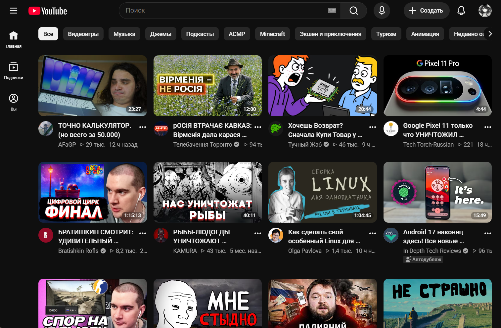
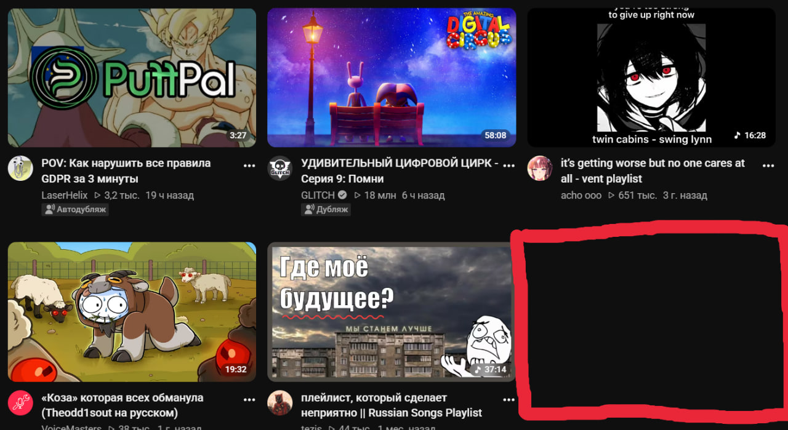
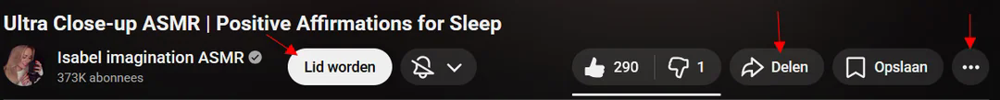

# uBlock-YT

<p align="center">
  
</p>

<p align="center">
  <a href="https://github.com/a111et/ublock-yt/stargazers"></a>
  <a href="https://github.com/a111et/ublock-yt/issues"></a>
  <a href="https://subscribe.adblockplus.org/?location=https://raw.githubusercontent.com/a111et/ublock-yt/refs/heads/main/ublock-yt.txt&title=uBlock-YT%20Filters"></a>
</p>

---

## 🎯 Project Goal
The main objective of this project is to make YouTube cleaner, less cluttered, and more enjoyable to use. It focuses on removing distracting elements, algorithmic clutter, and layout anomalies. 

*Planned future updates:* Custom user themes (skins) and tailored user scripts to further enhance or customize the layout.

## 📦 What is this?
This repository contains a curated collection of custom **uBlock Origin** rules specifically crafted for YouTube. It targets and eliminates irritating interface elements, clutter, and layout shifts that remain after standard ad blocking.

> [!TIP]
> Thank you so much for using my filters! If you notice any bugs, layout breaks, or have improvements, please open an Issue or a Pull Request with your solution. I will gladly merge it into the main list. Enjoy a cleaner YouTube!

---

## 🚀 Quick Setup & Installation

### Option 1: Automatic Subscription (Recommended)
Click the badge below to automatically import and subscribe to the filter list in uBlock Origin:

[](https://subscribe.adblockplus.org/?location=https%3A%2F%2Fraw.githubusercontent.com%2Fa111et%2Fublock-yt%2Frefs%2Fheads%2Fmain%2Fublock-YT-Clinin.txt&title=uBlock-YT+Filters)

### Option 2: Manual Import
1. Copy the raw filter link: `https://raw.githubusercontent.com/a111et/ublock-yt/refs/heads/main/ublock-YT-Clinin.txt`
2. Open **uBlock Origin Dashboard** -> **Filter lists** tab.
3. Scroll down to the bottom, check **Import...**, paste the link, and click **Apply changes**.

---

## 🛠️ Included Rules Breakdown

### 1. Enhanced Grid Layout (4 Videos Per Row)
Forces the YouTube homepage to display exactly 4 videos per row for better visibility and a less cramped look.


```adblock
youtube.com##ytd-rich-grid-renderer:style(--ytd-rich-grid-items-per-row: 4 !important;)
youtube.com##ytd-rich-grid-renderer:style(--ytd-rich-grid-posts-per-row: 4 !important;)
youtube.com##ytd-two-column-browse-results-renderer.grid-6-columns:style(width: 100% !important;)
youtube.com##ytd-two-column-browse-results-renderer.grid:not(.grid-disabled):style(max-width: 100% !important;)
youtube.com##ytd-rich-grid-renderer, html:style(--ytd-rich-grid-slim-items-per-row: 7 !important;)
youtube.com##ytd-rich-grid-renderer, html:style(--ytd-rich-grid-game-cards-per-row: 7 !important;)
youtube.com##+js(set-attr, ytd-rich-shelf-renderer, is-show-more-hidden)
youtube.com##+js(ra, hidden, ytd-rich-item-renderer, stay)

```

### 2. Fix Empty Placeholder Blocks

Removes the empty blank spaces and broken container blocks that appear on the homepage after ads are hidden.



```adblock
youtube.com##ytd-rich-section-renderer.style-scope.ytd-rich-grid-renderer

```

### 3. Total Shorts Blockout

Completely removes YouTube Shorts from the Desktop and Mobile interfaces, including the sidebar, homepage shelves, subscriptions, search results, and watch history.

```adblock
! YT - Homepage and Subscriptions (Grid View) - Hide the Shorts section
youtube.com##[is-shorts]
! YT - Menu - Hide the Shorts button
[www.youtube.com](https://www.youtube.com)###guide [title="Shorts"], .ytd-mini-guide-entry-renderer[title="Shorts"]
! YT - Search - Hide Shorts
[www.youtube.com](https://www.youtube.com)##ytd-search ytd-video-renderer:has([overlay-style="SHORTS"],[href^="/shorts/"])
! YT - Search, Channels, Subscriptions (List View) and Sidebar/Below Player Recommendations - Hide the Shorts sections
[www.youtube.com](https://www.youtube.com)##ytd-reel-shelf-renderer
! YT - Channels - Hide the Shorts tab
[www.youtube.com](https://www.youtube.com)##[tab-title="Shorts"]
! YT - Subscriptions - Hide Shorts - Grid View
[www.youtube.com](https://www.youtube.com)##ytd-browse[page-subtype="subscriptions"] ytd-grid-video-renderer:has([overlay-style="SHORTS"],[href^="/shorts/"])
! YT - Subscriptions - Hide Shorts - List View
[www.youtube.com](https://www.youtube.com)##ytd-browse[page-subtype="subscriptions"] ytd-video-renderer:has([overlay-style="SHORTS"],[href^="/shorts/"])
! YT - Subscriptions - New Layout - Hide Shorts
[www.youtube.com](https://www.youtube.com)##ytd-browse[page-subtype="subscriptions"] ytd-rich-item-renderer:has([overlay-style="SHORTS"],[href^="/shorts/"])
! YT - Sidebar - Hide Shorts
[www.youtube.com](https://www.youtube.com)###related :is(ytd-compact-video-renderer,yt-lockup-view-model):has([overlay-style="SHORTS"],[href^="/shorts/"])
! YT - History - Hide Shorts
[www.youtube.com](https://www.youtube.com)##ytd-item-section-renderer[page-subtype]:has(>#contents>[is-history]>#dismissible>ytd-thumbnail>#thumbnail[href^="/shorts/"])

! YT Mobile - Hide the Shorts Menu button
m.youtube.com##ytm-pivot-bar-item-renderer:has(>.pivot-shorts)
! YT Mobile - Hide the Shorts sections
m.youtube.com##:is(ytm-rich-section-renderer,grid-shelf-view-model):has([href^="/shorts/"])
! YT Mobile - Search - Hide Shorts
m.youtube.com##ytm-search ytm-video-with-context-renderer:has([href^="/shorts/"])
! YT Mobile - Channels - Hide the Shorts button
m.youtube.com##[tab-title="Shorts"]
! YT Mobile - History - Hide Shorts
m.youtube.com##[tab-identifier="FEhistory"] ytm-compact-video-renderer:has(>div>a[href^="/shorts/"])

```

### 4. Hide Community Posts on Homepage

Blocks text and image community posts from crowding your main video feed.

```adblock
! YT Homepage - Hide the Posts Section
[www.youtube.com](https://www.youtube.com)##ytd-browse[page-subtype="home"] ytd-rich-section-renderer:has(ytd-rich-item-renderer[is-post])
! YT Homepage - Hide Posts
[www.youtube.com](https://www.youtube.com)##ytd-browse[page-subtype="home"] ytd-rich-item-renderer[is-post]

```

### 5. Interface De-cluttering (Clean Player UI)

Cleans up the cluttered row of buttons beneath the video player (Join, Thanks, Clip, Download, etc.) keeping the focus purely on the video content.



```adblock
! YT - Below the Player Buttons - Join
[www.youtube.com](https://www.youtube.com)###top-row.ytd-watch-metadata #sponsor-button
! YT - Below the Player Buttons - Subscribe
[www.youtube.com](https://www.youtube.com)###top-row.ytd-watch-metadata #subscribe-button
! YT - Below the Player Buttons - Like/Dislike
[www.youtube.com](https://www.youtube.com)###top-row.ytd-watch-metadata .ytSegmentedLikeDislikeButtonViewModelHost
    ! YT - Below the Player Buttons - Like
    [www.youtube.com](https://www.youtube.com)###top-row.ytd-watch-metadata .ytLikeButtonViewModelHost
        ! YT - Below the Player Buttons - Like Count
        [www.youtube.com](https://www.youtube.com)###top-row.ytd-watch-metadata .ytLikeButtonViewModelHost .yt-spec-button-shape-next__button-text-content
    ! YT - Below the Player Buttons - Dislike
    [www.youtube.com](https://www.youtube.com)###top-row.ytd-watch-metadata .ytDislikeButtonViewModelHost
! YT - Below the Player Buttons - Ask
[www.youtube.com](https://www.youtube.com)###top-row.ytd-watch-metadata yt-button-view-model:has([aria-label="Ask"])
! YT - Below the Player Buttons - Thanks
[www.youtube.com](https://www.youtube.com)###top-row.ytd-watch-metadata yt-button-view-model:has([aria-label="Thanks"])
! YT - Below the Player Buttons - Share
[www.youtube.com](https://www.youtube.com)###top-row.ytd-watch-metadata yt-button-view-model:has([aria-label="Share"])
! YT - Below the Player Buttons - Download
[www.youtube.com](https://www.youtube.com)###top-row.ytd-watch-metadata ytd-download-button-renderer
! YT - Below the Player Buttons - Clip
[www.youtube.com](https://www.youtube.com)###top-row.ytd-watch-metadata yt-button-view-model:has([aria-label="Clip"])
! YT - Below the Player Buttons - Save
[www.youtube.com](https://www.youtube.com)###top-row.ytd-watch-metadata yt-button-view-model:has([aria-label="Save"])
! YT - Below the Player Buttons - More
[www.youtube.com](https://www.youtube.com)###top-row.ytd-watch-metadata [aria-label="More actions"]
    ! YT - Below the Player Buttons - More: Ask
    [www.youtube.com](https://www.youtube.com)##ytd-menu-service-item-renderer:has([d^="M480-80q0-83-31.5-156T363-363q-54-54-127-85.5T80-480q83"])
    ! YT - Below the Player Buttons - More: Thanks
    [www.youtube.com](https://www.youtube.com)##ytd-menu-service-item-renderer:has([d^="M16.25 2A6.7 6.7 0 0012 3.509 6.75 6.75"])
    ! YT - Below the Player Buttons - More: Clip
    [www.youtube.com](https://www.youtube.com)##ytd-menu-service-item-renderer:has([d^="M6 2.002a4 4 0 102.03 7.445L10.586"])
    ! YT - Below the Player Buttons - More: Save
    [www.youtube.com](https://www.youtube.com)##ytd-menu-service-item-renderer:has([d^="M19 2H5a2 2 0 00-2 2v16.887c0 1.266 1.382"])
    ! YT - Below the Player Buttons - More: Download
    [www.youtube.com](https://www.youtube.com)##ytd-menu-service-item-download-renderer
    ! YT - Below the Player Buttons - More: Report
    [www.youtube.com](https://www.youtube.com)##ytd-menu-service-item-renderer:has([d^="m4 2.999-.146.073A1.55 1.55 0 003 4.454v16.545a1"])

```

### 6. Purged Search Results

Restores the search results page to a classic look, showing **only actual videos, channels, and playlists** while hiding suggested shelves, "people also watched", and other algorithm traps.

```adblock
! YT Search - keep only videos (no shorts)
youtube.com##ytd-search ytd-item-section-renderer>#contents>:is(:not(ytd-video-renderer,yt-showing-results-for-renderer,[icon-name="promo-full-height:EMPTY_SEARCH"]),ytd-video-renderer:has([aria-label="Shorts"])),ytd-secondary-search-container-renderer

! YT Search - keep only videos (no shorts) and channels
youtube.com##ytd-search ytd-item-section-renderer>#contents>:is(:not(ytd-video-renderer,ytd-channel-renderer,yt-showing-results-for-renderer,[icon-name="promo-full-height:EMPTY_SEARCH"]),ytd-video-renderer:has([aria-label="Shorts"])),ytd-secondary-search-container-renderer

! YT Search - keep only videos (no shorts), channels and playlists
youtube.com##ytd-search ytd-item-section-renderer>#contents>:is(:not(ytd-video-renderer,ytd-channel-renderer,ytd-playlist-renderer,yt-lockup-view-model,yt-showing-results-for-renderer,[icon-name="promo-full-height:EMPTY_SEARCH"]),ytd-video-renderer:has([aria-label="Shorts"])),ytd-secondary-search-container-renderer

```

---

## 🔗 Check Out My Other Projects

If you like this project, check out **[Downloader](https://github.com/a111et/Downloader)** — a browser extension that adds quick download buttons for videos and photos into the context menu for many websites, including YouTube.

## 🤝 Credits & References

* Thanks to the community solutions found on the [r/uBlockOrigin Wiki](https://www.reddit.com/r/uBlockOrigin/wiki/solutions/youtube/)
* Developed and maintained by [@a111et](https://github.com/a111et)
